# DevOps Lab App

Repositorio: [https://github.com/santilp95/01_devops_cd_cd](https://github.com/santilp95/01_devops_cd_cd)

**Integrantes**

- Jeisson Alejandro Fuquene Buitrago (jeissonfubu@unisabana.edu.co)
- Santiago López Amaya (santiagoloam@unisabana.edu.co)

Aplicación web mínima (**Node.js + TypeScript + Express**) usada como caso práctico para el laboratorio técnico de la Actividad 3: **configurar un pipeline CI/CD básico usando GitHub Actions y Jenkins**.

## Endpoints

| Método | Ruta | Descripción |
|---|---|---|
| GET | `/health` | Health check, responde `{ "status": "ok" }` |
| GET | `/api/greet?name=X` | Devuelve un saludo personalizado |
| POST | `/api/sum` | Recibe `{ "a": number, "b": number }` y devuelve la suma |

## Ejecutar en local

```bash
npm install
npm run typecheck   # verificación de tipos (tsc --noEmit)
npm run lint         # ESLint (reglas TS)
npm test             # pruebas con Jest + ts-jest + cobertura
npm run build        # compila TypeScript a dist/
npm start             # corre dist/index.js en http://localhost:8080
npm run dev           # alternativa: corre src/index.ts directo con ts-node
```

## Flujo CI/CD

### CI — GitHub Actions (`.github/workflows/ci.yml`)

Se dispara automáticamente en cada `push` y en cada `pull_request` hacia `main`. Etapas:

1. Checkout del código (`actions/checkout`).
2. Configuración de Node.js con caché de dependencias.
3. Instalación de dependencias (`npm ci`).
4. Verificación de tipos (`npm run typecheck`).
5. Análisis estático con ESLint (`npm run lint`).
6. Ejecución de pruebas con Jest (`npm test`) y publicación del reporte de cobertura como artefacto.
7. Compilación a JavaScript (`npm run build`), validando que el proyecto compile antes de construir la imagen.

Si cualquier paso falla, el workflow se marca en rojo y bloquea la confianza en ese commit/PR.

**Resumen del run** — commit disparador, estado `Success` y artefacto generado:

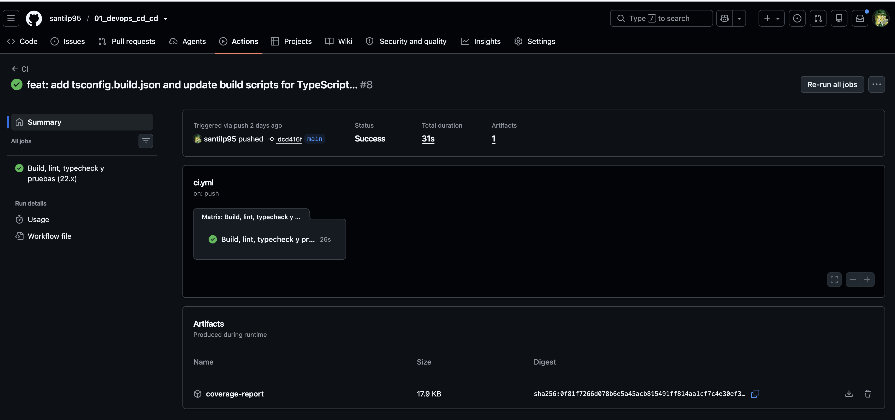

**Todos los steps del job**, en el mismo orden que la lista de arriba:

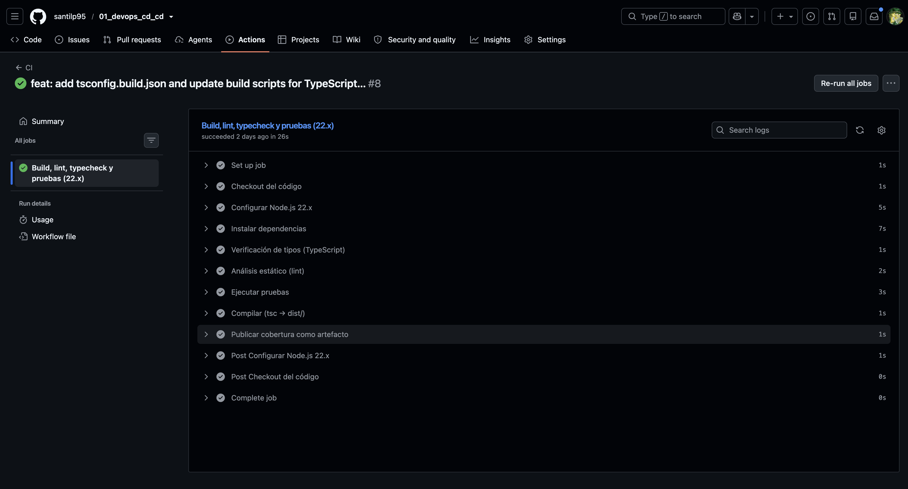

**Paso 1 — Checkout del código**:

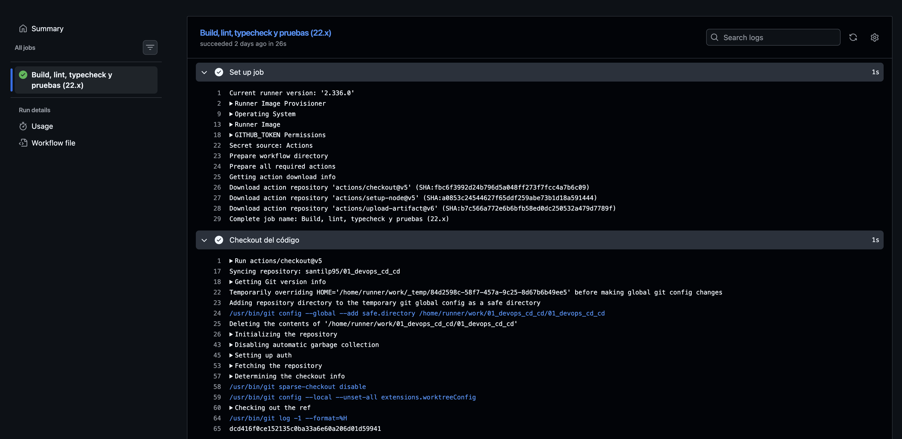

**Pasos 2 a 4 — Configurar Node.js, instalar dependencias y verificación de tipos**:

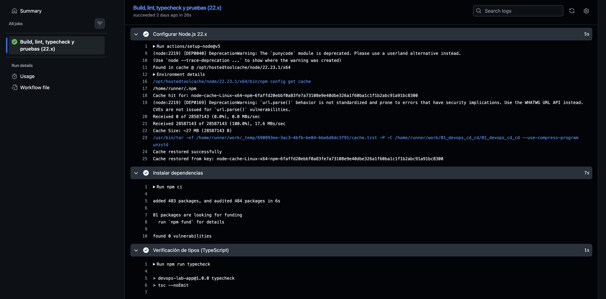

**Pasos 5 y 6 — Análisis estático (lint) y ejecución de pruebas** (7 tests en verde, 100% de cobertura):

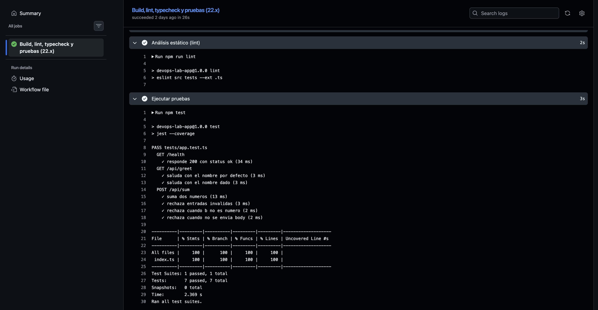

**Paso 7 — Compilación (`tsc → dist/`) y publicación de la cobertura como artefacto**:

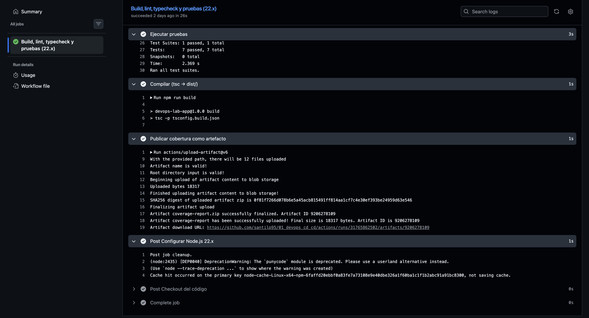

**Cierre del job** — artefacto subido y limpieza final (`Post` steps):

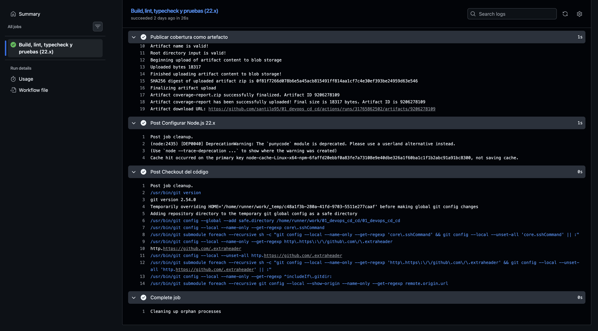

### CD — GitHub Actions (`.github/workflows/deploy.yml`)

Se dispara automáticamente vía `workflow_run` cuando el workflow **CI** termina en la rama `main`, y solo si concluyó con éxito (`conclusion == 'success'`). Etapas:

1. Checkout del commit exacto que probó el CI (`head_sha`, no el último de `main`).
2. Autenticación contra GCP con **Workload Identity Federation** (sin llaves JSON, usa `WIF_PROVIDER` + `WIF_SERVICE_ACCOUNT`).
3. Login a Artifact Registry con el access token obtenido.
4. Build y push de la imagen a `us-central1-docker.pkg.dev/<PROJECT_ID>/mi-app/mi-app:<sha>`.
5. Deploy a Cloud Run (servicio `mi-app`, región `us-central1`) con la acción `deploy-cloudrun`.

Requiere estos secrets configurados en el repositorio de GitHub (**Settings → Secrets and variables → Actions**): `GCP_PROJECT_ID`, `WIF_PROVIDER`, `WIF_SERVICE_ACCOUNT`.

### CD — Jenkins (`Jenkinsfile`)

Pipeline declarativo con solo 3 stages (sin pruebas de integración, esas ya las cubre el CI de GitHub Actions). Es una ruta de despliegue alternativa/manual al mismo servicio de Cloud Run, pensada para el laboratorio de Jenkins:

1. **Checkout**: clona el repositorio (`checkout scm`).
2. **Build**: construye la imagen Docker (multi-stage — compila TypeScript y produce una imagen final mínima corriendo como usuario no root) y la etiqueta con el número de build y `latest`.
3. **Deploy**: se autentica en GCP con una service account (clave JSON, distinto método de auth al de GitHub Actions), hace push de la imagen a **Artifact Registry** y despliega el servicio en **Cloud Run** con `gcloud run deploy`.

Se dispara automáticamente con cada push a `main` mediante `pollSCM('H/5 * * * *')`: Jenkins revisa el repositorio cada 5 minutos y arranca el build si hay commits nuevos en la rama configurada en el job. Se usa *polling* en vez de un webhook porque este Jenkins corre local (no accesible desde internet); si se expone públicamente, se puede cambiar a `githubPush()` + webhook de GitHub para un trigger inmediato.

> **Importante**: `Jenkinsfile` y `deploy.yml` publican en el **mismo** repositorio de Artifact Registry (`mi-app`) y despliegan al **mismo** servicio de Cloud Run (`mi-app`, `us-central1`) — es intencional, para reusar la infraestructura ya creada por el flujo de GitHub. Ambos ahora reaccionan a un push a `main` (uno vía `workflow_run` casi inmediato, el otro vía poll con hasta 5 min de latencia), así que un mismo commit puede disparar los dos pipelines; no hay conflicto, pero el último en terminar es el que queda como revisión activa en Cloud Run.

**Resumen del pipeline** — job `deploy-cloud-run-pipe`, run #6, los 4 stages (`Checkout`, `Build`, `Deploy`, `Post Actions`) en verde:

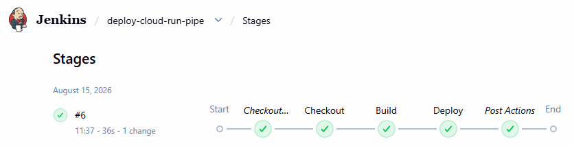

**Credencial configurada en Jenkins** — la clave de la service account de GCP guardada como *Secret file* (`gcp-service-account-key`), la misma que referencia el `Jenkinsfile`:

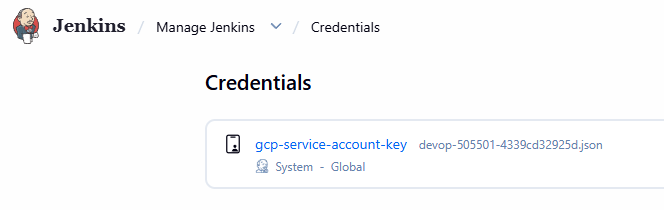

**Stage 1 — Checkout**: Jenkins obtiene el `Jenkinsfile` desde GitHub y clona el repositorio:

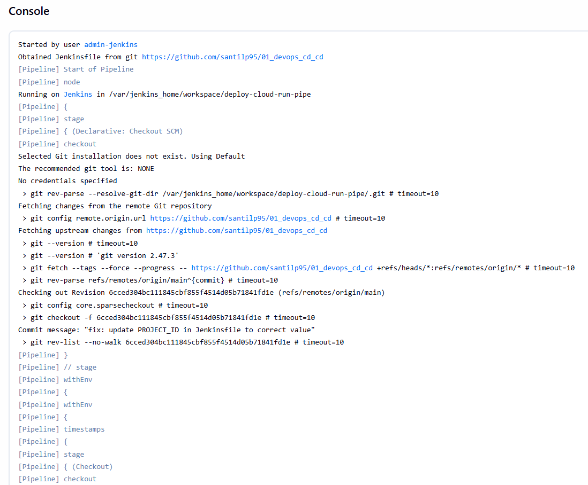

**Stage 2 — Build**: construye la imagen Docker y la etiqueta con el número de build y `latest`:

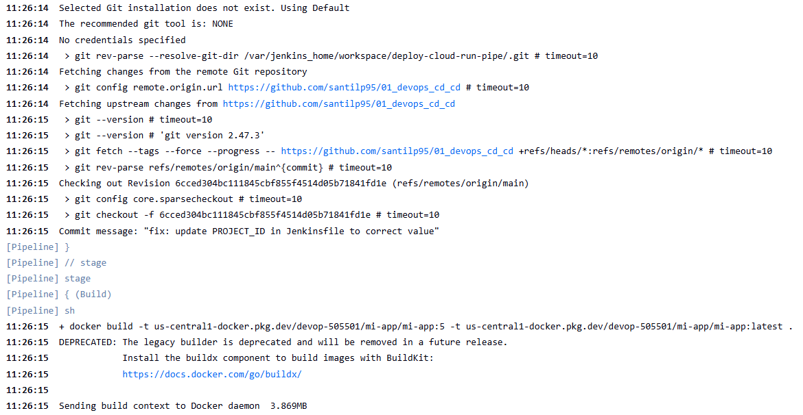

**Stage 3 — Deploy (autenticación y push)**: activa la service account, configura el proyecto GCP y publica la imagen en Artifact Registry (el `WARNING` sobre la Cloud Resource Manager API es informativo, no detiene el pipeline):

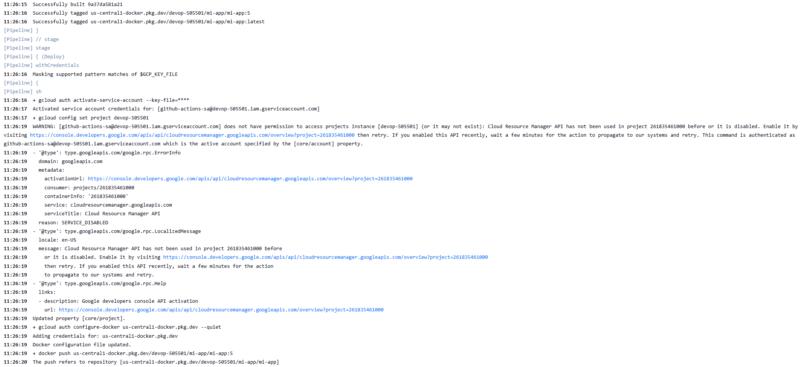

**Stage 3 — Deploy (gcloud run deploy)**: despliega la nueva revisión en Cloud Run, revoca las credenciales temporales y cierra el pipeline con `Finished: SUCCESS`:

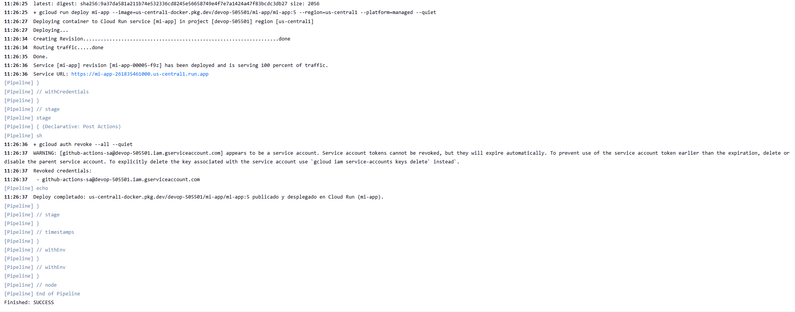

## Configuración necesaria antes de correr el Jenkinsfile

1. En GCP, crear una service account con estos roles:
   - `roles/artifactregistry.writer` (subir la imagen)
   - `roles/run.admin` (desplegar el servicio)
   - `roles/iam.serviceAccountUser` (actuar como la SA de ejecución de Cloud Run)
2. Generar y descargar la clave JSON de esa service account.
3. En Jenkins: **Manage Jenkins → Credentials** → agregar una credencial tipo *Secret file* con el contenido de la clave JSON:
   - ID: `gcp-service-account-key` (debe coincidir con el `credentialsId` del `Jenkinsfile`).
4. En el `Jenkinsfile`, reemplazar `TU_PROJECT_ID` por el ID real del proyecto GCP (el mismo que usa `deploy.yml`) y ajustar `REGION`/`SERVICE_NAME` solo si cambiaron respecto al flujo de GitHub Actions.
5. El repositorio `mi-app` en Artifact Registry probablemente **ya existe** (lo usa `deploy.yml`); solo créalo si aún no corriste ese workflow:
   ```bash
   gcloud artifacts repositories create mi-app \
     --repository-format=docker \
     --location=us-central1
   ```
6. Asegurarse de que el agente de Jenkins tenga **Docker** y el **SDK de gcloud** instalados, y que el usuario `jenkins` tenga permisos para usar Docker (`usermod -aG docker jenkins`).

## GCP

Resultado final del despliegue: el proyecto de Google Cloud usado por ambos pipelines (`devop-505501`) y la comprobación de que la app desplegada en Cloud Run responde correctamente.

**Proyecto en Google Cloud Console** (`01 devop`, project ID `devop-505501`), donde vive el servicio de Cloud Run, Artifact Registry y las service accounts usadas por CI/CD:

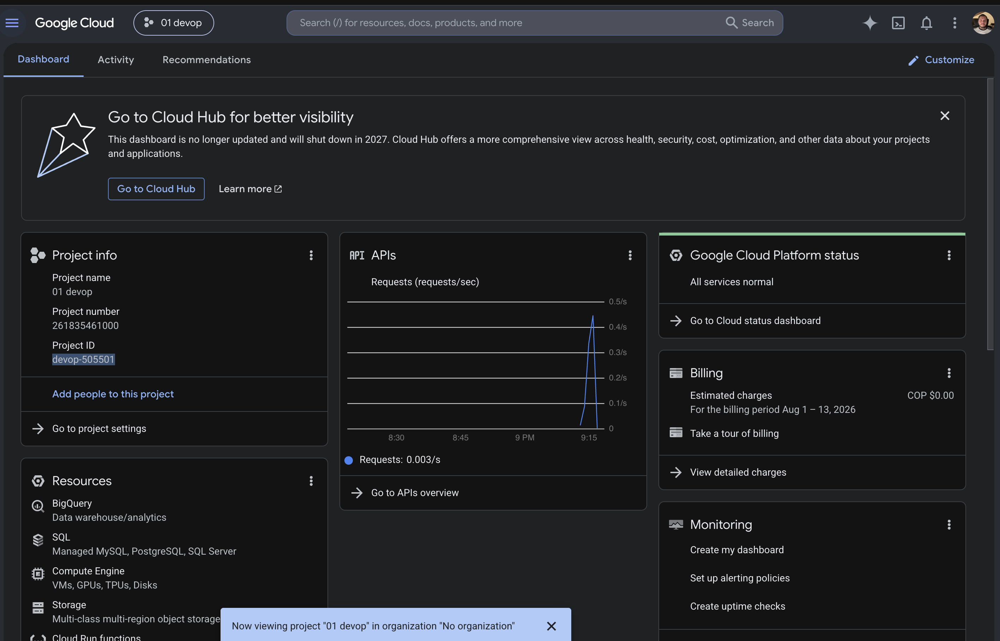

**Prueba del API ya desplegado**: petición a `https://mi-app-261835461000.us-central1.run.app/health` respondiendo `200 OK` con `{"status":"ok"}`, confirmando que el deploy (tanto por GitHub Actions como por Jenkins) queda funcionando en producción:

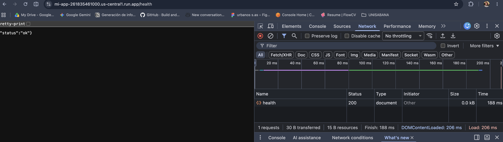

## Estructura del repositorio

```
.
├── .github/workflows/ci.yml       # Pipeline CI (GitHub Actions)
├── .github/workflows/deploy.yml   # Pipeline CD a Cloud Run (GitHub Actions)
├── Jenkinsfile                     # Pipeline CD a Cloud Run (Jenkins)
├── Dockerfile                   # Multi-stage: build TS → imagen de producción
├── tsconfig.json
├── jest.config.js
├── src/index.ts                 # Código de la aplicación (TypeScript)
├── tests/app.test.ts            # Pruebas unitarias (Jest + ts-jest + Supertest)
└── package.json
```
